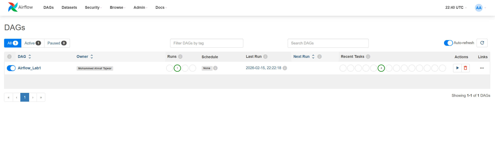
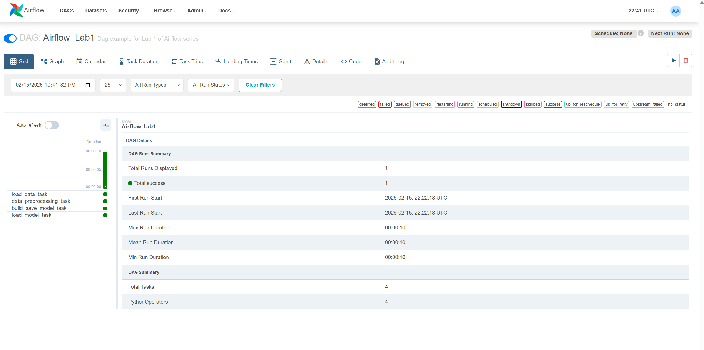
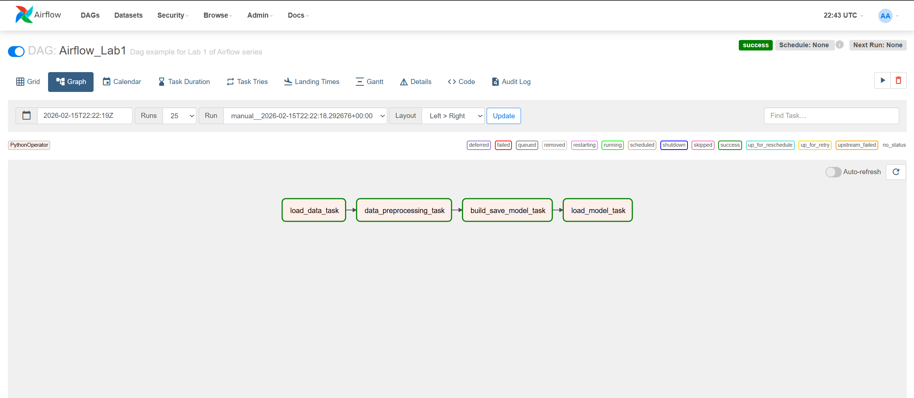
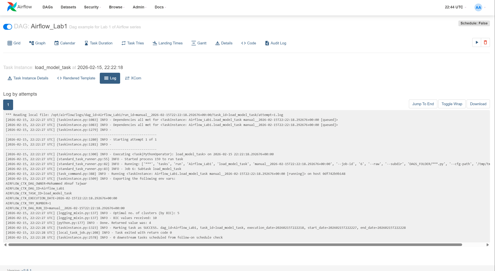
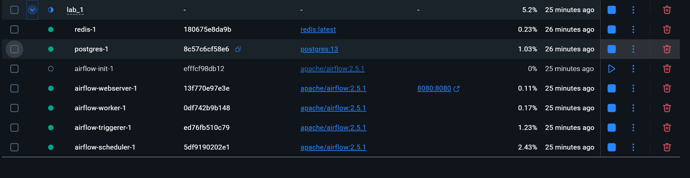

# Airflow Lab 1 — Mall Customers Clustering (GMM)

This project implements an **Apache Airflow** DAG that runs a clustering workflow on the **Mall Customers** dataset using a **Gaussian Mixture Model (GMM)**.  
The pipeline loads data, preprocesses it, trains a clustering model, selects the best number of clusters using **BIC**, and predicts the cluster for a test customer.

---

## Screenshots

### Airflow UI (DAGs list)


### DAG Graph view


### DAG Grid view


### Task Logs (load_model_task)


### Docker Containers (optional)


---

## Project Structure

```text
airflow_lab1/
├── dags/
│   ├── airflow.py
│   ├── data/
│   │   ├── file.csv
│   │   └── test.csv
│   └── src/
│       ├── __init__.py
│       └── lab.py
├── config/
├── logs/
├── plugins/
├── working_data/
├── docker-compose.yaml
├── .gitignore
└── README.md
```

> Note: `logs/`, `working_data/`, `.env`, and model artifacts should be ignored in Git (see `.gitignore`).

---

## Airflow

We use **Airflow** to author workflows as Directed Acyclic Graphs (DAGs) of tasks. The Airflow scheduler executes tasks based on dependencies and provides logs, monitoring, and re-runs through the UI.

### References
- Product: https://airflow.apache.org/
- Documentation: https://airflow.apache.org/docs/
- GitHub: https://github.com/apache/airflow

---

## Dataset

The **Mall Customers** dataset includes:

- `CustomerID`
- `Genre`
- `Age`
- `Annual Income (k$)`
- `Spending Score (1-100)`

For clustering, we use **only 3 numeric features**:

- `Age`
- `Annual Income (k$)`
- `Spending Score (1-100)`

---

## DAG Overview

DAG ID: `Airflow_Lab1`  
Schedule: `None` (manual trigger)

### Tasks
1. **load_data_task** — loads `dags/data/file.csv`  
2. **data_preprocessing_task** — selects 3 features + MinMax scaling  
3. **build_save_model_task** — trains GMM for different values of `k` and selects best `k` using **min BIC**  
4. **load_model_task** — loads saved model + scaler and predicts the cluster for `dags/data/test.csv`

---

## Test Input

Create/update `dags/data/test.csv` with one row:

```csv
Age,Annual Income (k$),Spending Score (1-100)
27,60,65
```

---

## Prerequisites

### Local (Windows / Mac / Linux)
- Docker Desktop installed and running
- WSL2 enabled (Windows recommended)
- Allocate at least **4GB** memory to Docker Engine (ideally **8GB**)

---

## Setup & Run (Docker)

### 1) Fetch `docker-compose.yaml`

**Mac/Linux**
```bash
curl -LfO 'https://airflow.apache.org/docs/apache-airflow/2.5.1/docker-compose.yaml'
```

**Windows (PowerShell)**
```powershell
curl -o docker-compose.yaml https://airflow.apache.org/docs/apache-airflow/2.5.1/docker-compose.yaml
```

### 2) Create required directories

**Mac/Linux**
```bash
mkdir -p ./dags ./logs ./plugins ./config ./working_data
```

**Windows (PowerShell)**
```powershell
mkdir dags,logs,plugins,config,working_data
```

### 3) Set the right Airflow user (`.env`)

**Mac/Linux**
```bash
echo -e "AIRFLOW_UID=$(id -u)" > .env
```

**Windows**
Create a `.env` file in the project root and set:
```text
AIRFLOW_UID=50000
```

### 4) Update `docker-compose.yaml`

Recommended updates:

```yaml
# Donot load examples
AIRFLOW__CORE__LOAD_EXAMPLES: 'false'

# Additional python packages (installed inside containers)
_PIP_ADDITIONAL_REQUIREMENTS: ${_PIP_ADDITIONAL_REQUIREMENTS:- pandas scikit-learn kneed}

# Output dir
- ${AIRFLOW_PROJ_DIR:-.}/working_data:/opt/airflow/working_data

# Change default admin credentials
_AIRFLOW_WWW_USER_USERNAME: ${_AIRFLOW_WWW_USER_USERNAME:-airflow2}
_AIRFLOW_WWW_USER_PASSWORD: ${_AIRFLOW_WWW_USER_PASSWORD:-airflow2}
```

### 5) Initialize the database
```bash
docker compose up airflow-init
```

### 6) Run Airflow
```bash
docker compose up
```

Wait until you see a health log like:
```text
airflow-webserver-1  | 127.0.0.1 - - "GET /health HTTP/1.1" 200 ...
```

### 7) Open Airflow UI
- Visit: http://localhost:8080
- Login:
  - Username: `airflow2`
  - Password: `airflow2`

### 8) Trigger the DAG
- Find `Airflow_Lab1`
- Toggle ON
- Click **Trigger DAG**

---

## Where to See Results

In Airflow UI:
- DAG → Grid/Graph → **load_model_task** → **Log**

Example outputs:
- `Optimal no. of clusters (by BIC): 5`
- `Returned value was: 4`

The cluster label is an **ID** (0..k-1), not a ranking.

---

## Stop / Cleanup

### Stop containers
```bash
docker compose down
```

### Stop and remove volumes (fresh reset)
```bash
docker compose down -v
```


