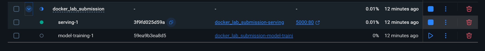
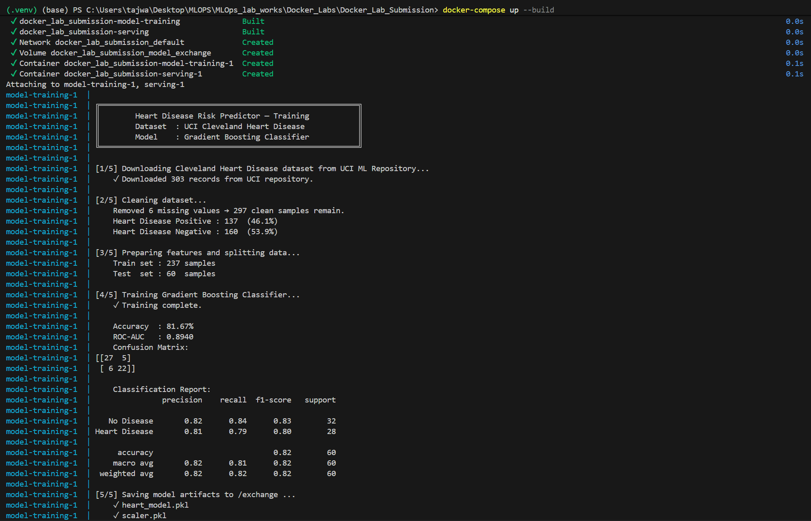
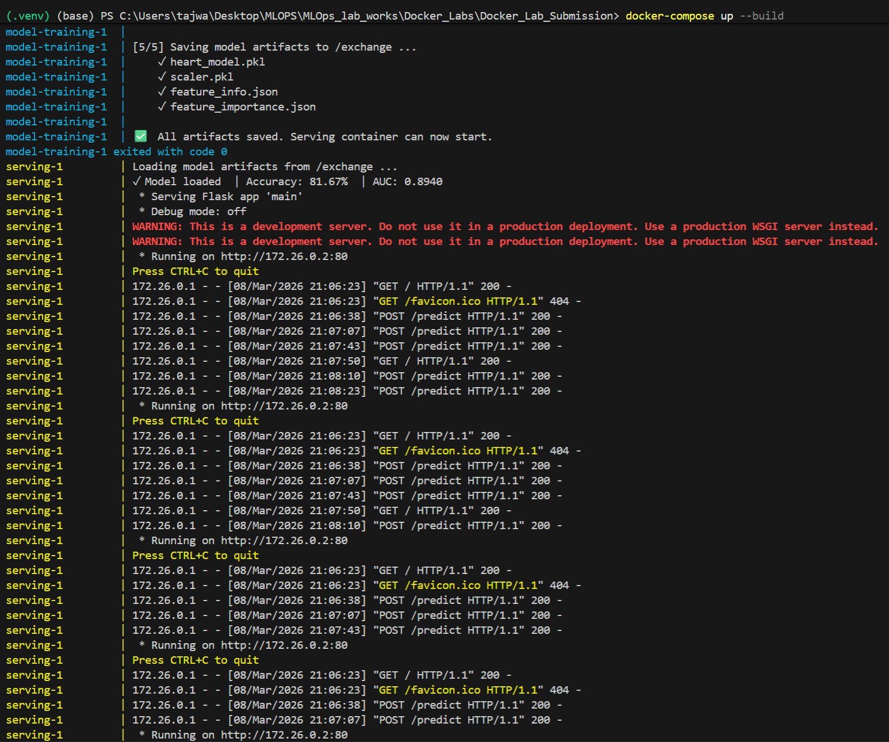
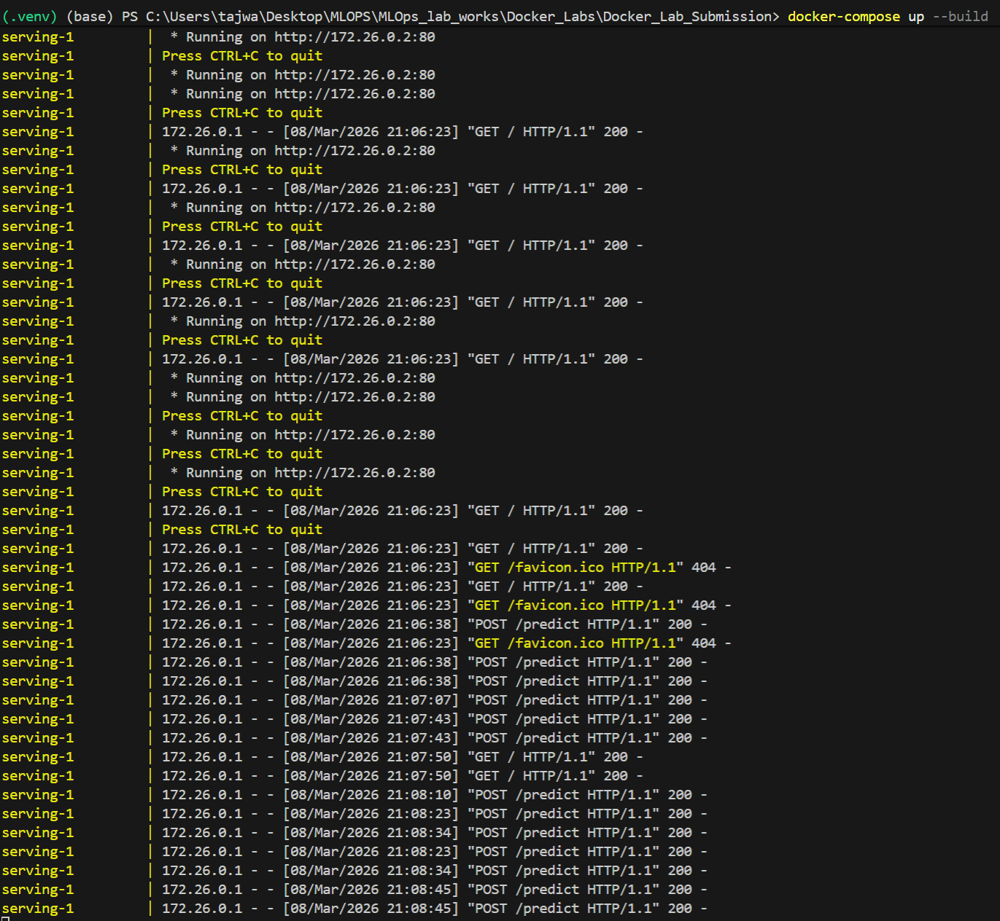
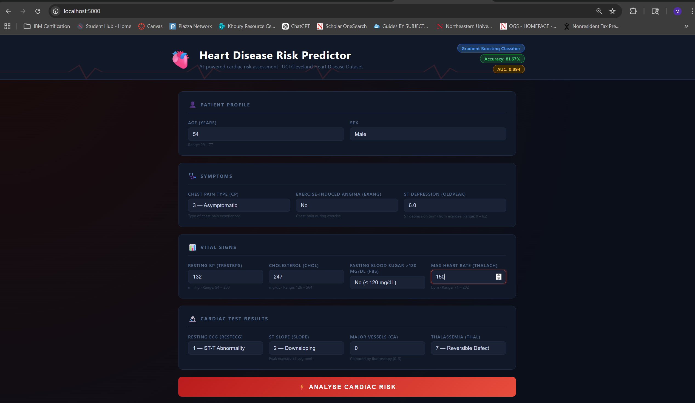
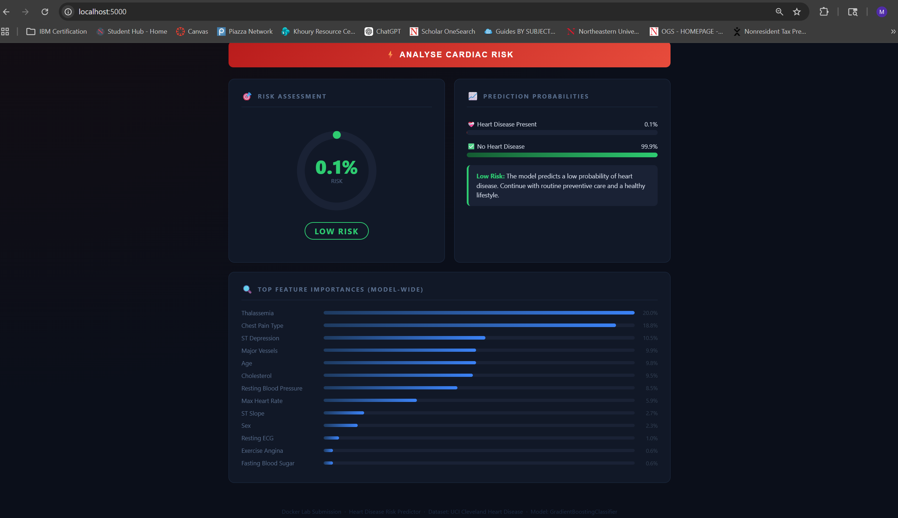
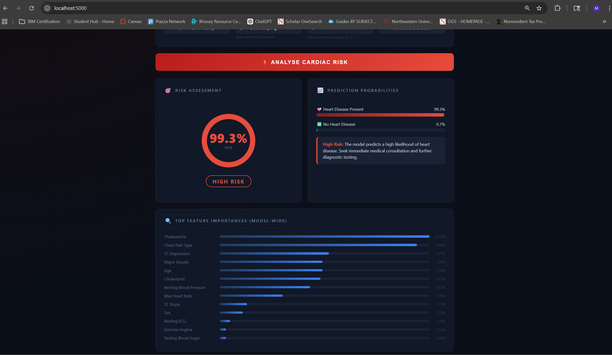

# 🫀 Docker Lab — Heart Disease Risk Predictor

In this Docker lab, we built a **Heart Disease Risk Predictor** — a fully containerised ML application that takes a patient's clinical measurements and predicts their risk of heart disease. The model is a **Gradient Boosting Classifier** trained on real-world patient data from the UCI Cleveland Heart Disease dataset (303 records). Once trained, the predictions are exposed through a **Flask REST API** and visualised in an interactive medical-themed dashboard where users can input patient details and instantly see a risk score, probability bars, and feature importance breakdown — all running inside Docker with zero local setup required.

---

## 📌 What This Lab Demonstrates

This lab containerises a **complete end-to-end ML pipeline** using Docker:

| Step | What Happens | Where |
|------|-------------|-------|
| 1 | Training container downloads real UCI heart disease data and trains a model | `model-training` service |
| 2 | Trained model is saved to a **shared Docker named volume** | `/exchange` |
| 3 | Serving container loads the model and starts a **Flask REST API** | `serving` service |
| 4 | User opens `localhost:5000` and gets a full **medical dashboard** | Browser |

**Key Docker concepts practised:**
- ✅ Multi-stage `Dockerfile` (separate `trainer` and `server` stages)
- ✅ Docker Compose orchestration
- ✅ Named volumes for inter-service artifact sharing
- ✅ Service dependency (`depends_on: condition: service_completed_successfully`)
- ✅ Port mapping (`5000:80`)

---

## 📂 Project Structure

```
Docker_Lab_Submission/
│
├── Dockerfile                  # Multi-stage build (trainer → server)
├── docker-compose.yml          # Two-service orchestration
├── requirements.txt            # Shared Python dependencies
│
├── src/
│   ├── model_training.py       # Downloads data, trains model, saves to /exchange
│   ├── main.py                 # Flask API server (loads from /exchange)
│   └── templates/
│       └── predict.html        # Medical-themed interactive dashboard
│
├── screenshots/                # Add screenshots here after running
└── README.md
```

---

## 🏥 Dataset — UCI Cleveland Heart Disease

- **Source:** [UCI ML Repository](https://archive.ics.uci.edu/ml/datasets/Heart+Disease)
- **Records:** 303 real patient records (297 after cleaning 6 missing values)
- **Features:** 13 clinical and diagnostic attributes

| Feature | Description | Type |
|---------|-------------|------|
| `age` | Patient age in years | Continuous |
| `sex` | Sex (1=Male, 0=Female) | Binary |
| `cp` | Chest pain type (0–3) | Categorical |
| `trestbps` | Resting blood pressure (mmHg) | Continuous |
| `chol` | Serum cholesterol (mg/dL) | Continuous |
| `fbs` | Fasting blood sugar > 120 mg/dL | Binary |
| `restecg` | Resting ECG result (0–2) | Categorical |
| `thalach` | Maximum heart rate achieved (bpm) | Continuous |
| `exang` | Exercise-induced angina | Binary |
| `oldpeak` | ST depression from exercise (mm) | Continuous |
| `slope` | Slope of peak exercise ST segment | Categorical |
| `ca` | Major vessels coloured by fluoroscopy (0–3) | Ordinal |
| `thal` | Thalassemia (3=Normal, 6=Fixed, 7=Reversible) | Categorical |
| `target` | **Heart disease present?** (0=No, 1=Yes) | **Target** |

---

## 🤖 Model — Gradient Boosting Classifier

```
GradientBoostingClassifier(
    n_estimators   = 200,
    learning_rate  = 0.1,
    max_depth      = 4,
    min_samples_split = 5,
    subsample      = 0.8,
    random_state   = 42
)
```

**Why Gradient Boosting?**
Sequential ensemble of weak decision trees where each tree corrects the errors of the previous one — well-suited for tabular medical data with mixed feature types.

**Training Pipeline:**
1. Download Cleveland data from UCI repository
2. Replace `?` (missing) → drop 6 rows → 297 clean samples
3. Binarise target: `0` = no disease, `1–4` = disease present → `1`
4. 80/20 stratified train/test split
5. `StandardScaler` normalisation
6. Train `GradientBoostingClassifier`
7. Evaluate (Accuracy + ROC-AUC + Confusion Matrix)
8. Save `heart_model.pkl`, `scaler.pkl`, `feature_info.json`, `feature_importance.json` → `/exchange`

---

## 🐳 Installing Docker Desktop

Docker Desktop is required to build and run this lab. Follow the steps for your operating system.

---

### 🪟 Windows

1. Go to [https://www.docker.com/products/docker-desktop/](https://www.docker.com/products/docker-desktop/) and click **Download for Windows**
2. Run the downloaded `Docker Desktop Installer.exe`
3. During installation, make sure **"Use WSL 2 instead of Hyper-V"** is checked (recommended for Windows 10/11)
4. If prompted, enable **WSL 2** — Windows will guide you through installing it
5. After installation, restart your computer
6. Launch **Docker Desktop** from the Start Menu
7. Wait for the whale icon 🐳 in the taskbar to stop animating — Docker is ready when it shows **"Docker Desktop is running"**

**Verify installation:**
```bash
docker --version
docker-compose --version
```

> **Note:** Docker Desktop requires Windows 10 64-bit (Build 19041 or later) or Windows 11.

---

### 🍎 macOS

1. Go to [https://www.docker.com/products/docker-desktop/](https://www.docker.com/products/docker-desktop/) and click **Download for Mac**
   - Choose **Apple Silicon (M1/M2/M3)** or **Intel Chip** depending on your Mac
2. Open the downloaded `.dmg` file
3. Drag the **Docker** icon into your **Applications** folder
4. Open Docker from Applications
5. macOS will ask for your password to grant privileged access — allow it
6. Wait for the whale icon 🐳 in the menu bar to stop animating

**Verify installation:**
```bash
docker --version
docker-compose --version
```

> **Note:** Requires macOS 12 (Monterey) or later.

---

### 🐧 Linux (Ubuntu/Debian)

Docker Desktop is available for Linux, but many Linux users install the **Docker Engine** directly (lighter, CLI-only):

```bash
# 1. Update packages
sudo apt-get update

# 2. Install dependencies
sudo apt-get install -y ca-certificates curl gnupg

# 3. Add Docker's official GPG key
sudo install -m 0755 -d /etc/apt/keyrings
curl -fsSL https://download.docker.com/linux/ubuntu/gpg | sudo gpg --dearmor -o /etc/apt/keyrings/docker.gpg

# 4. Add Docker repository
echo \
  "deb [arch=$(dpkg --print-architecture) signed-by=/etc/apt/keyrings/docker.gpg] \
  https://download.docker.com/linux/ubuntu $(lsb_release -cs) stable" | \
  sudo tee /etc/apt/sources.list.d/docker.list > /dev/null

# 5. Install Docker Engine and Compose plugin
sudo apt-get update
sudo apt-get install -y docker-ce docker-ce-cli containerd.io docker-compose-plugin

# 6. Run Docker without sudo (log out and back in after this)
sudo usermod -aG docker $USER
```

**Verify installation:**
```bash
docker --version
docker compose version
```

> **Note:** On Linux, use `docker compose` (with a space) instead of `docker-compose`.

---

## 🚀 How to Run

### Prerequisites
- Docker Desktop installed and running (see above)

### Step 1 — Clone the repo (or navigate to this folder)
```bash
cd Docker_Labs/Docker_Lab_Submission
```

### Step 2 — Build and run with Docker Compose
```bash
docker-compose up --build
```

This single command:
1. Builds both Docker images from the multi-stage `Dockerfile`
2. Starts the `model-training` container → downloads data → trains model → saves to volume
3. Waits for training to finish (`service_completed_successfully`)
4. Starts the `serving` container → loads model → opens Flask on port 80

### Step 3 — Open the dashboard
```
http://localhost:5000
```

### Step 4 — Stop everything
```bash
docker-compose down
```

To also remove the named volume (clears saved model):
```bash
docker-compose down -v
```

---

## 🐳 Docker Commands Reference

| Command | Purpose |
|---------|---------|
| `docker-compose up --build` | Build images and start all services |
| `docker-compose up` | Start without rebuilding |
| `docker-compose down` | Stop and remove containers |
| `docker-compose down -v` | Stop, remove containers **and** named volume |
| `docker-compose logs model-training` | View training logs |
| `docker-compose logs serving` | View serving logs |
| `docker ps` | List running containers |
| `docker images` | List built images |
| `docker volume ls` | List Docker volumes |
| `docker-compose build --no-cache` | Force full rebuild |

---

## 🌐 API Endpoints

| Method | Endpoint | Description |
|--------|----------|-------------|
| `GET` | `/` | Interactive prediction dashboard |
| `POST` | `/predict` | JSON inference — returns risk % and level |
| `GET` | `/health` | Container health check + model metrics |

### Example `/predict` request

```bash
curl -X POST http://localhost:5000/predict \
  -H "Content-Type: application/json" \
  -d '{
    "age": 63, "sex": 1, "cp": 3, "trestbps": 145,
    "chol": 233, "fbs": 1, "restecg": 0, "thalach": 150,
    "exang": 0, "oldpeak": 2.3, "slope": 0, "ca": 0, "thal": 3
  }'
```

### Example response

```json
{
  "prediction": 1,
  "risk_pct": 87.3,
  "no_risk_pct": 12.7,
  "risk_level": "High Risk",
  "risk_color": "#e74c3c"
}
```

---

## 📸 Screenshots

### Docker Desktop — Both Containers Running
> After `docker-compose up --build`, both the `model-training` and `serving` containers are visible in Docker Desktop. The training container exits successfully after saving the model, and the serving container stays up on port 5000.



### Training Container Logs
> Docker Compose terminal output showing dataset download, model training, accuracy score, ROC-AUC, and confirmation that all artifacts were saved to `/exchange`.





### Dashboard — Input Form
> The medical-themed dashboard at `http://localhost:5000` with 4 grouped input sections: Patient Profile, Symptoms, Vital Signs, and Cardiac Test Results.



### Risk Assessment Result
> After clicking "Analyse Cardiac Risk" — animated risk gauge, probability confidence bars, and feature importance chart rendered dynamically.




---

## 🗂️ Architecture Diagram

```
┌─────────────────────────────────────────────────────────────┐
│                     docker-compose up                        │
│                                                             │
│  ┌──────────────────────┐     named volume: model_exchange  │
│  │  model-training      │──────────────────────────────┐    │
│  │  (Stage 1 / trainer) │   heart_model.pkl            │    │
│  │                      │   scaler.pkl                 │    │
│  │  Python 3.10-slim    │   feature_info.json          │    │
│  │  + scikit-learn      │   feature_importance.json    │    │
│  │  + pandas            │                              ▼    │
│  │                      │        /exchange/            │    │
│  │  1. Download UCI data│◄─────────────────────────────┘    │
│  │  2. Clean & split    │                              │    │
│  │  3. Train GBC        │                              │    │
│  │  4. Save artifacts ──┼──────────────────────────────┘    │
│  └──────────────────────┘                                   │
│          ↓ service_completed_successfully                    │
│  ┌──────────────────────┐                                   │
│  │  serving             │◄──── reads /exchange ──────────── │
│  │  (Stage 2 / server)  │                                   │
│  │                      │                                   │
│  │  Python 3.10-slim    │                                   │
│  │  + Flask             │   http://localhost:5000           │
│  │  + scikit-learn      │◄──────────────────── Browser      │
│  │                      │                                   │
│  │  GET  /              │  ── Medical Dashboard             │
│  │  POST /predict       │  ── JSON Inference                │
│  │  GET  /health        │  ── Health Check                  │
│  └──────────────────────┘                                   │
└─────────────────────────────────────────────────────────────┘
```

---

## 📊 Model Performance (Actual Training Results)

```
[1/5] Downloading Cleveland Heart Disease dataset from UCI ML Repository...
    ✓ Downloaded 303 records from UCI repository.

[2/5] Cleaning dataset...
    Removed 6 missing values → 297 clean samples remain.
    Heart Disease Positive : 137  (46.1%)
    Heart Disease Negative : 160  (53.9%)

[3/5] Preparing features and splitting data...
    Train set : 237 samples
    Test  set : 60  samples

[4/5] Training Gradient Boosting Classifier...
    ✓ Training complete.

    Accuracy  : 81.67%
    ROC-AUC   : 0.8940
    Confusion Matrix:
    [[27  5]
     [ 6 22]]

    Classification Report:
                   precision    recall  f1-score   support

       No Disease       0.82      0.84      0.83        32
    Heart Disease       0.81      0.79      0.80        28

         accuracy                           0.82        60
        macro avg       0.82      0.81      0.82        60
     weighted avg       0.82      0.82      0.82        60

[5/5] Saving model artifacts to /exchange ...
    ✓ heart_model.pkl
    ✓ scaler.pkl
    ✓ feature_info.json
    ✓ feature_importance.json

✅  All artifacts saved. Serving container can now start.
```

---

## 🔧 Troubleshooting

| Problem | Solution |
|---------|----------|
| Port 5000 already in use | Change `"5000:80"` to `"5001:80"` in `docker-compose.yml` |
| Training container fails (no internet) | Ensure Docker has internet access; check `docker-compose logs model-training` |
| Volume not found error | Run `docker-compose down -v` then `docker-compose up --build` again |
| Model not loading in serving | Training must complete first; check `model-training` logs for errors |
