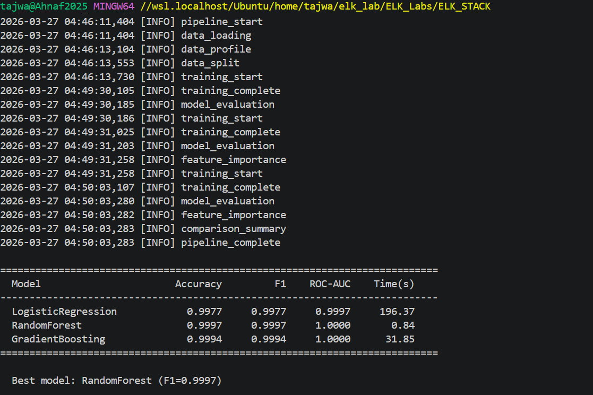
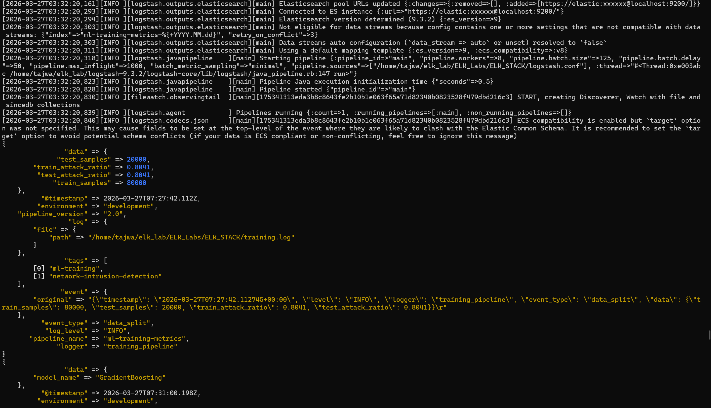
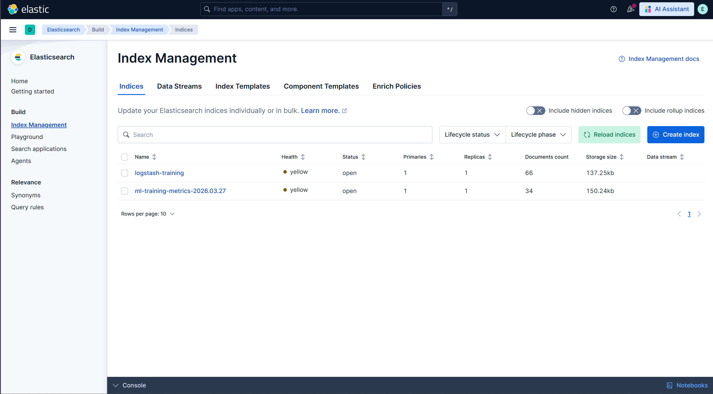
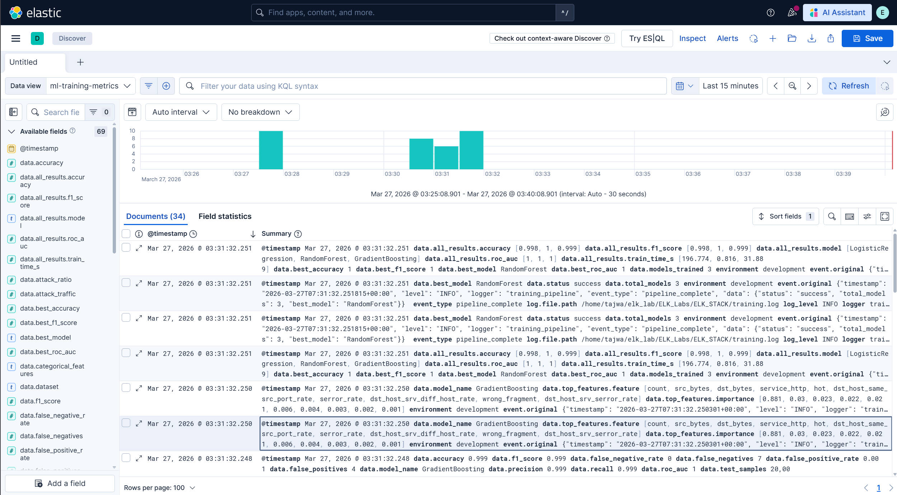
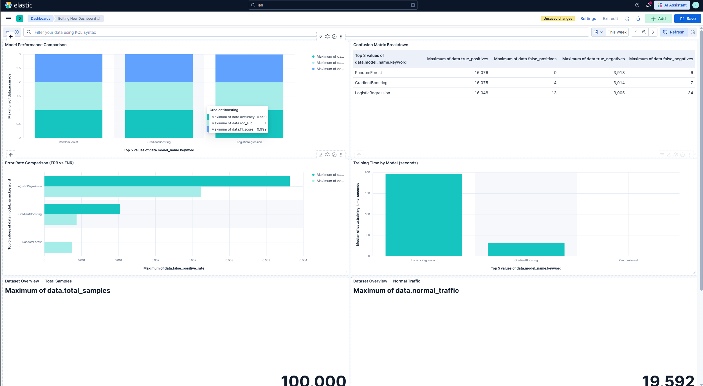

# Network Intrusion Detection with ELK Stack

> An end-to-end lab for setting up the **ELK Stack** (Elasticsearch, Logstash, Kibana)
> on **Windows WSL Ubuntu** and building an ML-powered **network intrusion detection
> pipeline** with real-time metric visualization in Kibana.

---

## Table of Contents

1. [Project Overview](#1-project-overview)
2. [Architecture](#2-architecture)
3. [Repository Structure](#3-repository-structure)
4. [Prerequisites](#4-prerequisites)
5. [Part A — ELK Stack Installation on WSL](#5-part-a--elk-stack-installation-on-wsl)
6. [Part B — ML Training Pipeline](#6-part-b--ml-training-pipeline)
7. [Part C — Logstash Ingestion](#7-part-c--logstash-ingestion)
8. [Part D — Kibana Dashboard](#8-part-d--kibana-dashboard)
9. [Screenshots](#9-screenshots)
10. [Troubleshooting](#10-troubleshooting)
11. [References](#11-references)

---

## 1. Project Overview

### What We Built

This project demonstrates a complete **Security Information and Event Monitoring
(SIEM)** workflow:

1. **Train** three ML models (Logistic Regression, Random Forest, Gradient Boosting)
   on the **KDD Cup 99** network intrusion dataset — a real-world cybersecurity
   benchmark with ~494,000 network connections labeled as normal or attack traffic.

2. **Ingest** the structured JSON training logs into **Elasticsearch** via a
   production-grade **Logstash** pipeline.

3. **Visualize** model performance metrics (accuracy, F1, ROC-AUC, confusion matrix,
   false positive/negative rates, training time, feature importance) on a **Kibana**
   dashboard.

### Why This Matters

The ELK Stack is the industry standard for log aggregation and analysis. In
cybersecurity, it powers SIEM platforms that detect threats in real time. This lab
connects the ML side (building intrusion detection models) with the observability
side (monitoring model metrics through ELK) — mirroring how production ML systems
are monitored.

---

## 2. Architecture

```
┌─────────────────┐     ┌──────────────┐     ┌───────────────┐     ┌──────────┐
│  train_model.py │────>│ training.log │────>│   Logstash    │────>│  Elastic │
│                 │     │ (JSON Lines) │     │  (logstash.   │     │  search  │
│  - Load KDD99   │     │              │     │   conf)       │     │          │
│  - Preprocess   │     │ Each line is │     │  - Parse JSON │     │ Index:   │
│  - Train 3      │     │ a structured │     │  - Type-cast  │     │ ml-train │
│    models       │     │ JSON object  │     │  - Enrich     │     │ ing-     │
│  - Evaluate     │     │              │     │  - Route to   │     │ metrics  │
│  - Log metrics  │     │              │     │    ES index   │     │          │
└─────────────────┘     └──────────────┘     └───────────────┘     └────┬─────┘
                                                                        │
                                                                        v
                                                                  ┌──────────┐
                                                                  │  Kibana  │
                                                                  │          │
                                                                  │ Dashboard│
                                                                  │ with 6+  │
                                                                  │ panels   │
                                                                  └──────────┘
```

---

## 3. Repository Structure

```
ELK_STACK/
├── README.md                   # This file — full lab guide
├── LICENSE                     # MIT License
├── requirements.txt            # Python dependencies
├── train_model.py              # ML training pipeline (KDD Cup 99)
├── training.log                # Generated output (JSON Lines)
├── logstash.conf               # Industry-level Logstash pipeline config
├── data/
│   └── README.md               # Dataset documentation
└── dashboards/
    └── README.md               # Step-by-step Kibana dashboard setup
```

---

## 4. Prerequisites

| Software         | Version    | Purpose                                |
|------------------|------------|----------------------------------------|
| Windows 10/11    | -          | Host OS with WSL2 enabled              |
| Ubuntu (WSL)     | 20.04+     | Linux environment for running ELK      |
| Java JDK         | 17         | Required by Elasticsearch              |
| Elasticsearch    | 8.x / 9.x | Search and analytics engine            |
| Kibana           | 8.x / 9.x | Visualization and dashboarding         |
| Logstash         | 8.x / 9.x | Log ingestion and transformation       |
| Python           | 3.9+       | ML training pipeline                   |
| pip              | latest     | Python package manager                 |

---

## 5. Part A — ELK Stack Installation on WSL

### Step 1: Enable WSL2

Open **PowerShell as Administrator** and run:

```powershell
wsl --install
```

Restart your computer. Ubuntu will be available from the Start menu.

### Step 2: Download the ELK Stack Components

Download the **Linux (tar.gz)** versions from the official Elastic website:

- **Elasticsearch:** https://www.elastic.co/downloads/elasticsearch
- **Kibana:** https://www.elastic.co/downloads/kibana
- **Logstash:** https://www.elastic.co/downloads/logstash
- **Java JDK 17:** https://www.oracle.com/java/technologies/downloads/

> **Note:** Ensure the Elasticsearch version matches the Kibana and Logstash versions.

### Step 3: Move Files from Windows to Ubuntu

Open your Ubuntu terminal and copy the downloaded `.tar.gz` files:

```bash
# Navigate to your Windows Downloads folder
cd /mnt/c/Users/<your-windows-username>/Downloads

# Move files to your home directory in Ubuntu
sudo mv elasticsearch-*.tar.gz /home/
sudo mv kibana-*.tar.gz /home/
sudo mv logstash-*.tar.gz /home/
sudo mv jdk-17*.tar.gz /home/
```

### Step 4: Extract the Archives

```bash
cd /home

sudo tar -xzvf jdk-17*.tar.gz
sudo tar -xzvf elasticsearch-*.tar.gz
sudo tar -xzvf kibana-*.tar.gz
sudo tar -xzvf logstash-*.tar.gz
```

### Step 5: Configure Java Environment

```bash
nano ~/.bashrc
```

Add these lines at the bottom of the file:

```bash
export JAVA_HOME=/home/jdk-17
export PATH=$JAVA_HOME/bin:$PATH
```

Save (`Ctrl+S`), exit (`Ctrl+X`), then reload:

```bash
source ~/.bashrc
java -version   # Should print: openjdk version "17.x.x"
```

### Step 6: Set File Permissions

Replace `<your-username>` with your Ubuntu username:

```bash
sudo chown -R <your-username>:<your-username> /home/elasticsearch-*
sudo chown -R <your-username>:<your-username> /home/kibana-*
sudo chown -R <your-username>:<your-username> /home/logstash-*
```

> **Creating a user (if needed):**
> ```bash
> sudo adduser <your-username>
> ```

### Step 7: Start Elasticsearch

Open a **new terminal tab** and run:

```bash
cd /home/elasticsearch-*/bin
./elasticsearch
```

Wait until you see `started` in the output. On **first run**, Elasticsearch prints:

- A generated password for the `elastic` user
- An enrollment token for Kibana

**Save both of these!** If you missed them:

```bash
# Reset the elastic user password
cd /home/elasticsearch-*/bin
./elasticsearch-reset-password -u elastic

# Generate a new Kibana enrollment token
./elasticsearch-create-enrollment-token --scope kibana
```

### Step 8: Start Kibana

Open another **new terminal tab**:

```bash
cd /home/kibana-*/bin
./kibana
```

> If you get a permissions error, try: `sudo ./kibana --allow-root`

### Step 9: Connect Kibana to Elasticsearch

1. Open your browser and go to **http://localhost:5601**
2. Paste the **enrollment token** from Step 7
3. Log in with:
   - **Username:** `elastic`
   - **Password:** (the one from Step 7)

You should now see the Kibana home page.

### Step 10: Verify the Stack

```bash
# Test Elasticsearch is running (use your actual password)
curl -k -u elastic:<your-password> https://localhost:9200
```

You should see a JSON response with the cluster name and version.

---

## 6. Part B — ML Training Pipeline

### What the Script Does

`train_model.py` performs the following:

1. **Downloads** the KDD Cup 99 network intrusion dataset (auto-cached locally)
2. **Preprocesses** 41 features (scales numeric, one-hot encodes categorical)
3. **Trains** three classifiers on 80,000 training samples:
   - **Logistic Regression** — fast, linear baseline
   - **Random Forest** — ensemble of 200 decision trees
   - **Gradient Boosting** — sequential boosting with 150 estimators
4. **Evaluates** each model on 20,000 test samples with 12+ metrics
5. **Logs** everything as structured JSON Lines to `training.log`
6. **Prints** a comparison summary table to the console

### Step 1: Install Python Dependencies

```bash
cd /home/<your-username>/elk_lab/ELK_Labs/ELK_STACK
pip install -r requirements.txt
```

### Step 2: Run the Training Pipeline

```bash
python train_model.py
```

The script will download the dataset on first run, train all three models, and
print a comparison summary table when finished.

### Step 3: Verify the Log Output

```bash
# Pretty-print the first log entry
head -1 training.log | python -m json.tool
```

You should see structured JSON with fields like `timestamp`, `level`, `event`, and `data`.

---

## 7. Part C — Logstash Ingestion

### What the Config Does

`logstash.conf` is an industry-level pipeline that:

- Reads `training.log` using the **JSON codec** (no fragile regex/grok)
- Parses ISO-8601 timestamps into `@timestamp`
- **Type-casts** numeric metrics (float/integer) for Elasticsearch aggregations
- Adds **pipeline metadata** (name, version, environment)
- **Drops** malformed events gracefully

### Step 1: Update Credentials in `logstash.conf`

Open `logstash.conf` and update the `output` section with your Elasticsearch
password and CA certificate path:

```
password => "your_elasticsearch_password"
ssl_certificate_authorities => ["/home/<your-username>/elasticsearch-9.x.x/config/certs/http_ca.crt"]
```

Also update the `input` section `path` to point to your `training.log` location.

### Step 2: Run Logstash

```bash
cd /home/logstash-*/
bin/logstash -f /path/to/logstash.conf
```

You should see each log event printed to the console in `rubydebug` format. Once
all events are processed, Logstash continues to watch the file for new entries.

### Step 3: Verify Data in Elasticsearch

```bash
curl -k -u elastic:<your-password> \
  "https://localhost:9200/ml-training-metrics-*/_count"
```

You should see a count matching the number of log lines in `training.log`.

---

## 8. Part D — Kibana Dashboard

See [dashboards/README.md](dashboards/README.md) for the full step-by-step guide.

### Quick Summary

1. **Create a Data View** in Kibana: index pattern `ml-training-metrics-*`
2. **Verify data** in the Discover tab
3. **Build 6 visualizations:**
   - Model Performance Comparison (bar chart: F1, accuracy, ROC-AUC)
   - Confusion Matrix Breakdown (data table)
   - Error Rate Comparison (FPR vs FNR bar chart)
   - Training Time by Model (bar chart)
   - Dataset Overview (metric tiles: total, normal, attack counts)
   - Pipeline Event Timeline (stacked bar over time)
4. **Arrange** into a dashboard and save

---

## 9. Screenshots

### Training Pipeline Output

The ML training pipeline trains three models on the KDD Cup 99 dataset and prints
a comparison summary to the console.



---

### Logstash Ingestion

Logstash reads `training.log` and ships each JSON event to Elasticsearch, printing
each record in `rubydebug` format.



---

### Elasticsearch Index Management

The `ml-training-metrics-2026.03.27` index contains 34 documents — one per log
event from the training pipeline.



---

### Kibana Discover

The Discover view shows all 34 ingested log events with 69 parsed fields including
`data.accuracy`, `data.f1_score`, `data.model_name`, `event_type`, and more.



---

### Kibana Dashboard

The ML Training Pipeline Dashboard visualizes model metrics across four panels:
Model Performance Comparison, Confusion Matrix Breakdown, Error Rate Comparison
(FPR vs FNR), and Training Time by Model.



---

## 10. Troubleshooting

### Elasticsearch won't start

```
ERROR: max virtual memory areas vm.max_map_count [65530] is too low
```

**Fix:**
```bash
sudo sysctl -w vm.max_map_count=262144
```

To make it permanent, add to `/etc/sysctl.conf`:
```
vm.max_map_count=262144
```

---

### Kibana shows "Unable to connect to Elasticsearch"

- Make sure Elasticsearch is running (`curl -k https://localhost:9200`)
- Check the enrollment token hasn't expired (generate a new one if needed)
- Verify `kibana.yml` has the correct `elasticsearch.hosts` setting

---

### Logstash shows `_jsonparsefailure` tags

- The log file may have non-JSON content (like old plaintext logs)
- **Fix:** Re-run `python train_model.py` to regenerate a clean `training.log`
- The pipeline config drops failed events automatically

---

### Logstash can't connect to Elasticsearch (SSL error)

- Verify `ES_CA_CERT` points to the correct certificate file:
  ```bash
  ls -la $ES_CA_CERT
  ```
- If using a self-signed cert for testing, you can temporarily set:
  ```
  ssl_verification_mode => "none"
  ```
  (Not recommended for production)

---

### Python script fails with `ModuleNotFoundError`

```bash
pip install -r requirements.txt
```

If using a system Python that conflicts, create a virtual environment:
```bash
python -m venv venv
source venv/bin/activate
pip install -r requirements.txt
python train_model.py
```

---

### Fields show as "text" in Kibana instead of numbers

- Logstash `mutate convert` may not have run. Check Logstash console output.
- In Kibana, go to **Stack Management > Data Views** and click **Refresh field list**
- If the index was created before the convert filter was added, delete the old
  index and re-ingest:
  ```bash
  curl -k -u elastic:<password> -X DELETE "https://localhost:9200/ml-training-metrics-*"
  ```

---

## 11. References

- [KDD Cup 1999 Dataset — UCI ML Repository](https://archive.ics.uci.edu/ml/datasets/kdd+cup+1999+data)
- [Elasticsearch Documentation](https://www.elastic.co/guide/en/elasticsearch/reference/current/index.html)
- [Kibana Documentation](https://www.elastic.co/guide/en/kibana/current/index.html)
- [Logstash Documentation](https://www.elastic.co/guide/en/logstash/current/index.html)
- [scikit-learn Documentation](https://scikit-learn.org/stable/)
- Tavallaee, M., et al. "A detailed analysis of the KDD CUP 99 data set." IEEE Symposium on Computational Intelligence for Security and Defense Applications (2009)

---

**License:** MIT
