# Mushroom Safety Classifier — End-to-End ML Pipeline with W&B

An advanced experiment tracking lab that builds a complete ML pipeline for classifying mushrooms as **edible** or **poisonous**, with full [Weights & Biases](https://wandb.ai) integration, a FastAPI backend, and a Gradio frontend.

> **Dataset:** [UCI Mushroom Classification](https://www.kaggle.com/datasets/uciml/mushroom-classification) — 8,124 mushrooms, 22 categorical features, binary classification.

---

## Table of Contents

- [What This Lab Covers](#what-this-lab-covers)
- [W\&B Features Implemented](#wb-features-implemented)
- [Project Architecture](#project-architecture)
- [Pipeline Phases](#pipeline-phases)
- [Setup & Installation](#setup--installation)
- [Running the Pipeline](#running-the-pipeline)
- [W\&B Dashboard Screenshots](#wb-dashboard-screenshots)
- [UI Screenshots](#ui-screenshots)
- [API Documentation](#api-documentation)
- [Troubleshooting](#troubleshooting)
- [Tech Stack](#tech-stack)

---

## What This Lab Covers

This lab goes beyond basic experiment logging (covered in Lab 1 & Lab 2) and implements an **end-to-end MLOps pipeline**:

| Phase | What It Does |
|-------|-------------|
| **Phase 1** | Exploratory Data Analysis — logs data artifacts, EDA tables, and feature analysis to W&B |
| **Phase 2** | Model Training — runs a Bayesian hyperparameter sweep across XGBoost, LightGBM, and Random Forest |
| **Phase 3** | Model Registry — finds the best model and registers it with production aliases |
| **Phase 4** | API Serving — FastAPI backend that loads the best model and serves predictions |
| **Phase 5** | User Interface — Gradio frontend where users describe a mushroom and get a safety verdict |

---

## W&B Features Implemented

### Features from Lab 1 & Lab 2 (Enhanced)
- **`wandb.init()`** — Run tracking with project, entity, job type, and tags
- **`wandb.config`** — Hyperparameter logging for every training run
- **`wandb.log()`** — Metrics logging (accuracy, F1, precision, recall, ROC-AUC)
- **`wandb.Image()`** — Confusion matrices, ROC curves, PR curves, feature importance plots
- **`wandb.Artifact()`** — Model artifact saving with metadata

### New Features (Not in Lab 1 or Lab 2)

#### 1. W&B Sweeps (Bayesian Hyperparameter Optimization)
The pipeline runs a **Bayesian optimization sweep** across 3 model types and 6+ hyperparameters simultaneously. The sweep configuration (`sweep_config.yaml`) defines:
- **Method:** Bayesian optimization (not random or grid — smarter search)
- **Metric:** Maximizes validation F1 score
- **Search space:** model type, learning rate, max depth, n_estimators, subsample, colsample_bytree
- **Early termination:** Hyperband — kills underperforming runs early

```yaml
method: bayes
metric:
  name: val/f1
  goal: maximize
```

#### 2. W&B Data Versioning with Artifacts
Raw and processed datasets are logged as **versioned artifacts**, enabling full reproducibility:
- `mushroom-raw-data` — Original CSV from Kaggle
- `mushroom-processed-data` — Encoded train/val/test splits with metadata

#### 3. W&B Tables for Interactive EDA
EDA results are logged as **W&B Tables** — interactive, filterable, and sortable directly in the dashboard:
- Full dataset table (8,124 rows, all features decoded to human-readable labels)
- Class distribution table
- Feature importance (Chi-squared) table
- Dataset summary statistics

#### 4. W&B Alerts
Automated notifications when important events occur:
- **High-performance alert:** Fires when a sweep run achieves F1 > 0.98
- **Production model alert:** Fires when a new model is registered

#### 5. W&B Model Registry (Artifact Aliasing)
The best model from the sweep is tagged with `production` and `best` aliases, enabling:
- The API to pull the production model by alias
- Version tracking across training iterations
- Full lineage: dataset artifact -> training run -> model artifact

---

## Project Architecture

```
Lab3/
├── main.py                 # Orchestrator — runs all phases or launches servers
├── phase1_eda.py           # Phase 1: EDA + W&B Artifacts & Tables
├── phase2_train.py         # Phase 2: Multi-model training + W&B Sweeps
├── phase3_registry.py      # Phase 3: Model Registry (artifact aliasing)
├── sweep_config.yaml       # Bayesian sweep configuration
├── app/
│   ├── __init__.py
│   ├── api.py              # Phase 4: FastAPI backend (prediction API)
│   ├── ui.py               # Phase 5: Gradio frontend (mushroom checker UI)
│   └── utils.py            # Shared utilities (preprocessing, encoding, constants)
├── data/
│   └── mushrooms.csv       # Dataset (download from Kaggle)
├── artifacts/              # Generated: trained models, encoders (gitignored)
├── wandb/                  # Generated: W&B local run data (gitignored)
├── requirements.txt
├── .gitignore
├── LICENSE
└── README.md
```

### Data Flow

```
                    ┌─────────────┐
                    │  Kaggle CSV  │
                    └──────┬──────┘
                           │
                    ┌──────▼──────┐
                    │  Phase 1:   │──── W&B Artifacts (raw data)
                    │  EDA        │──── W&B Tables (interactive EDA)
                    └──────┬──────┘──── W&B Images (plots)
                           │
                    ┌──────▼──────┐
                    │  Phase 2:   │──── W&B Sweep (Bayesian optimization)
                    │  Training   │──── W&B Metrics (per-run)
                    └──────┬──────┘──── W&B Alerts (high F1)
                           │
                    ┌──────▼──────┐
                    │  Phase 3:   │──── W&B Artifact aliases (production)
                    │  Registry   │──── W&B Alert (new production model)
                    └──────┬──────┘
                           │
              ┌────────────┼────────────┐
              │                         │
       ┌──────▼──────┐          ┌──────▼──────┐
       │  Phase 4:   │          │  Phase 5:   │
       │  FastAPI    │◄─────────│  Gradio UI  │
       │  (port 8000)│          │  (port 7860)│
       └─────────────┘          └─────────────┘
```

---

## Pipeline Phases

### Phase 1: Exploratory Data Analysis

Logs to W&B:
- **Raw dataset** as a versioned artifact
- **Full data table** (8,124 rows) as an interactive W&B Table
- **Class distribution** — edible (51.8%) vs poisonous (48.2%)
- **Feature vs class** stacked bar charts for key features (odor, gill-color, habitat, etc.)
- **Chi-squared feature importance** — ranks all 21 features by discriminative power
- **Processed data splits** (train/val/test) as versioned artifacts

### Phase 2: Model Training + Sweeps

Trains 3 model architectures via W&B Bayesian Sweep:

| Model | Description |
|-------|-------------|
| **XGBoost** | Gradient boosted trees — `XGBClassifier` |
| **LightGBM** | Light gradient boosting — `LGBMClassifier` |
| **Random Forest** | Ensemble of decision trees — `RandomForestClassifier` |

Per-run logging:
- Confusion matrix (validation + test)
- ROC curve with AUC score
- Precision-Recall curve with AP score
- Feature importance (bar chart + W&B Table)
- All standard metrics (accuracy, F1, precision, recall)

### Phase 3: Model Registry

- Queries W&B API to find the best run by validation F1
- Tags the best model artifact with `production` and `best` aliases
- Logs a summary table with model metadata
- Sends a W&B Alert about the new production model

### Phase 4: FastAPI Backend

Endpoints:

| Method | Endpoint | Description |
|--------|----------|-------------|
| `GET` | `/` | Health check |
| `GET` | `/health` | Server status |
| `GET` | `/model-info` | Current model details |
| `GET` | `/available-models` | List all trained models |
| `GET` | `/feature-options` | Valid dropdown values for each feature |
| `POST` | `/switch-model/{type}` | Switch between xgboost/lightgbm/random_forest |
| `POST` | `/predict` | Classify a mushroom (returns prediction + confidence) |

### Phase 5: Gradio UI

- **Model selector dropdown** — switch between XGBoost, LightGBM, Random Forest at runtime
- **Feature input** — organized by category (Cap, Gill, Stalk, Other) with accordion sections
- **Visual result** — big color-coded verdict card (green = EDIBLE, red = POISONOUS, orange = UNCERTAIN)
- **Confidence scores** — probability breakdown for edible vs poisonous
- **Top features** — shows the 5 most important features contributing to the prediction

---

## Setup & Installation

### Prerequisites
- Python 3.10+
- [Conda](https://docs.conda.io/en/latest/) (recommended) or pip
- A [W&B account](https://wandb.ai/site) (free tier works)

### Step 1: Clone the Repository

```bash
git clone https://github.com/ahnaf015/MLOps_Lab_Works.git
cd MLOps_Lab_Works/Experiment_Tracking_Labs/W&B/Lab3
```

### Step 2: Create Conda Environment

```bash
conda create -n mushroom-classifier python=3.10 -y
conda activate mushroom-classifier
```

### Step 3: Install Dependencies

```bash
pip install -r requirements.txt
```

### Step 4: Download the Dataset

1. Go to [Kaggle: Mushroom Classification](https://www.kaggle.com/datasets/uciml/mushroom-classification)
2. Download `mushrooms.csv`
3. Place it in the `data/` folder:

```
Lab3/data/mushrooms.csv
```

### Step 5: Login to W&B

```bash
wandb login
```

Enter your API key from [wandb.ai/authorize](https://wandb.ai/authorize).

### Step 6: Configure W&B Entity

Open `app/utils.py` and update the entity to your W&B team/username:

```python
WANDB_ENTITY = "your-wandb-team-or-username"
```

---

## Running the Pipeline

### Run Everything (Recommended)

```bash
python main.py --sweep
```

This runs all 3 phases (EDA -> Sweep with 10 Bayesian runs -> Registry) then launches both servers.

### Run Phase by Phase

```bash
# Phase 1: EDA + data versioning
python main.py --phase 1

# Phase 2: Training with W&B Sweep (10 runs)
python main.py --phase 2 --sweep

# Phase 2: Single model (quick test)
python main.py --phase 2
python main.py --phase 2 --model lightgbm
python main.py --phase 2 --model random_forest

# Phase 3: Register best model
python main.py --phase 3

# Phase 4 & 5: Launch servers only
python main.py --serve
```

### Train All 3 Models (for model switching in UI)

```bash
python phase2_train.py --model xgboost
python phase2_train.py --model lightgbm
python phase2_train.py --model random_forest
```

### Access Points

| Service | URL |
|---------|-----|
| **Gradio UI** | http://localhost:7860 |
| **FastAPI Docs** | http://localhost:8000/docs |
| **FastAPI Root** | http://localhost:8000 |
| **W&B Dashboard** | https://wandb.ai/your-entity/mushroom-safety-classifier |

---

## W&B Dashboard Screenshots

### Project Overview
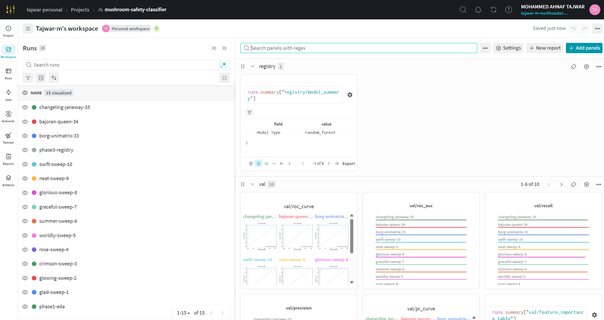 

### Sweep Results
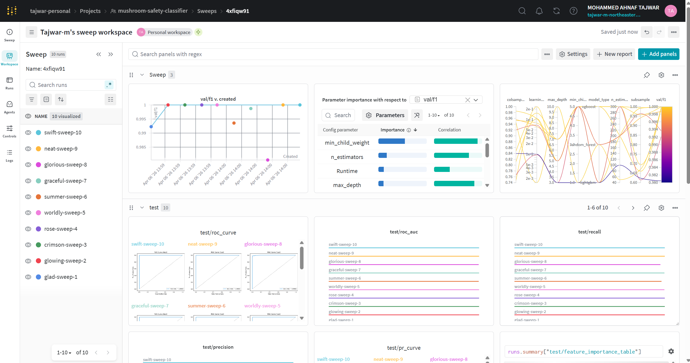 

### EDA Tables
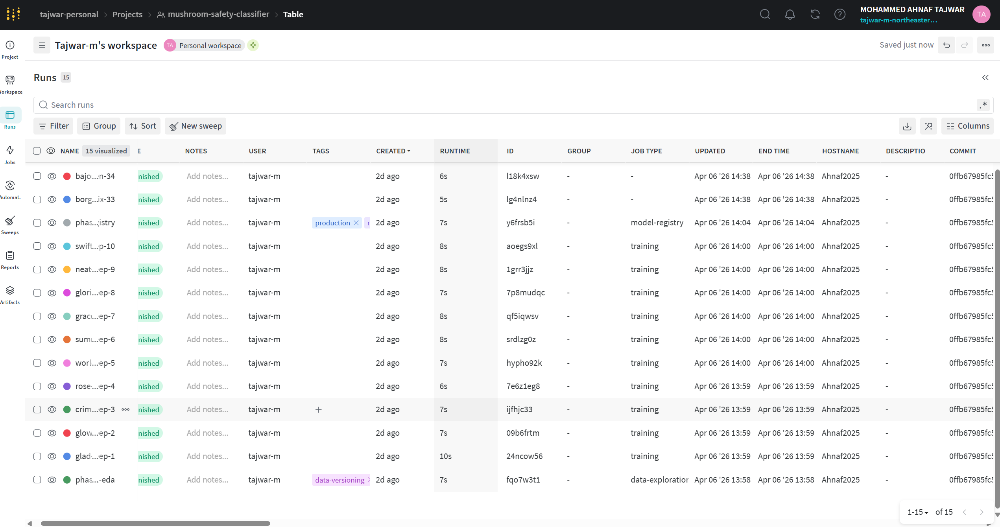

### ROC Curve
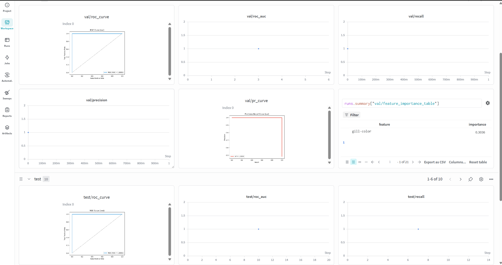

### Feature Importance
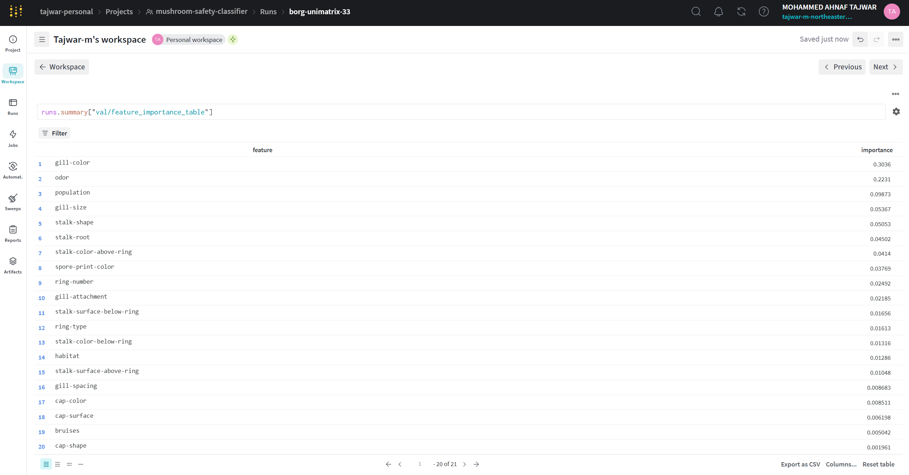

### Data Artifacts
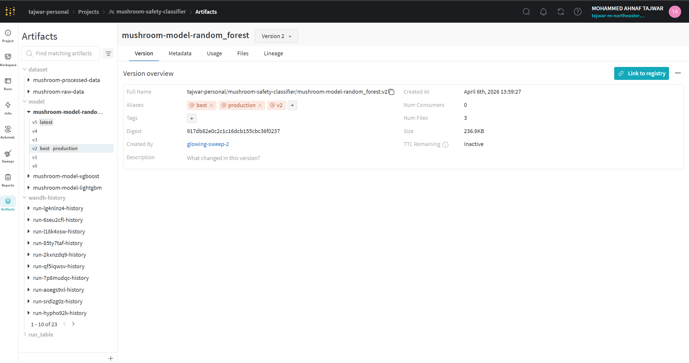 

### W&B Alerts
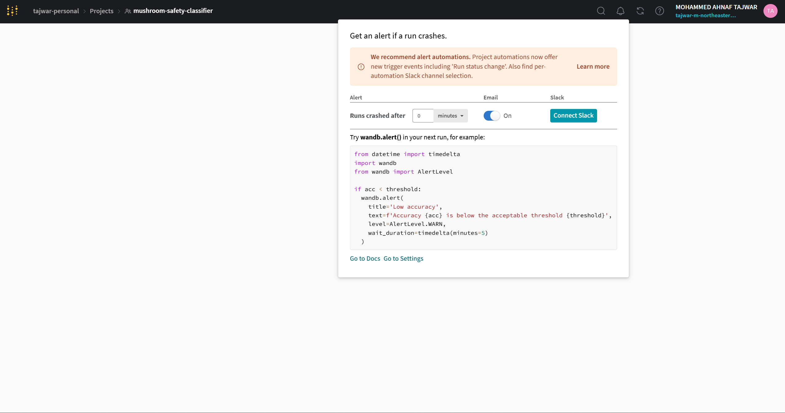

---

## UI Screenshots

### Gradio Interface
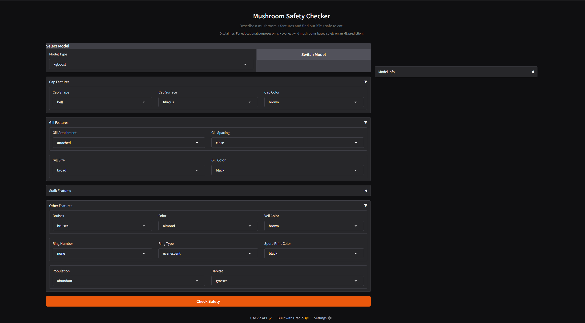 

### Edible Prediction
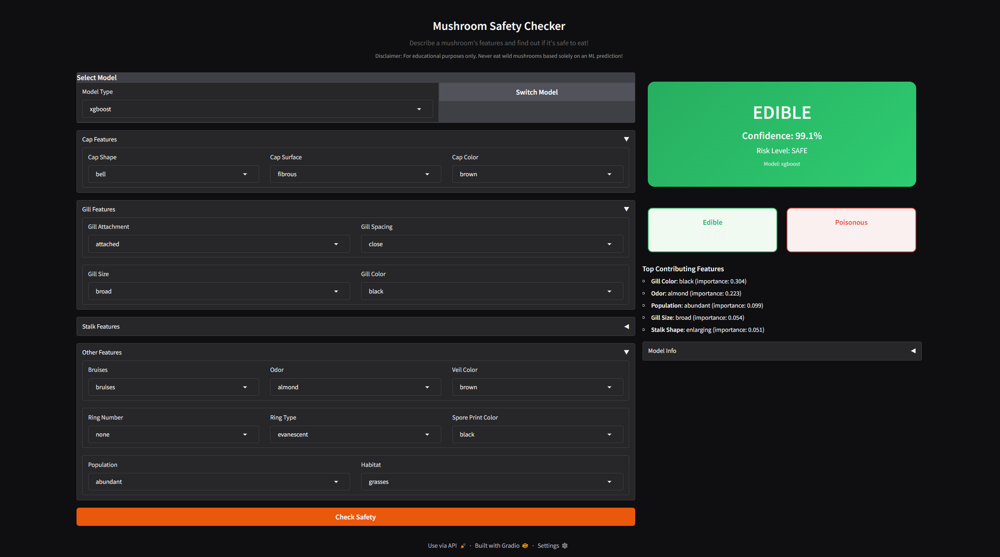 

### Poisonous Prediction
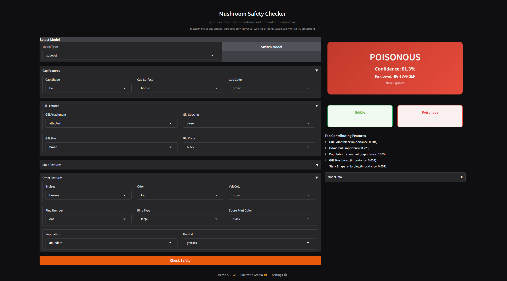 

### FastAPI Swagger Docs
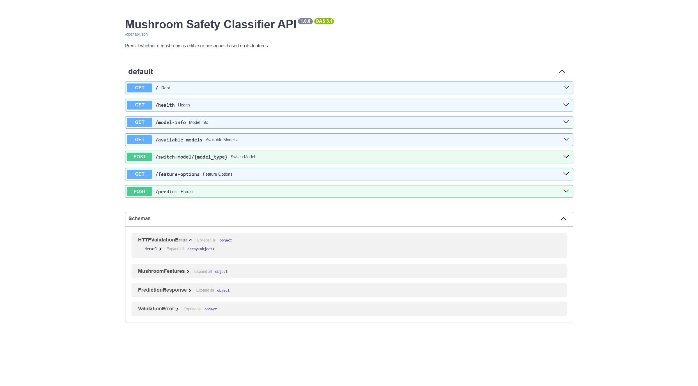

---

## API Documentation

### Predict a Mushroom

```bash
curl -X POST http://localhost:8000/predict \
  -H "Content-Type: application/json" \
  -d '{
    "cap-shape": "convex",
    "cap-surface": "smooth",
    "cap-color": "brown",
    "bruises": "bruises",
    "odor": "almond",
    "gill-attachment": "free",
    "gill-spacing": "close",
    "gill-size": "broad",
    "gill-color": "brown",
    "stalk-shape": "enlarging",
    "stalk-root": "bulbous",
    "stalk-surface-above-ring": "smooth",
    "stalk-surface-below-ring": "smooth",
    "stalk-color-above-ring": "white",
    "stalk-color-below-ring": "white",
    "veil-color": "white",
    "ring-number": "one",
    "ring-type": "pendant",
    "spore-print-color": "brown",
    "population": "several",
    "habitat": "woods"
  }'
```

**Response:**

```json
{
  "prediction": "edible",
  "confidence": 0.997,
  "probability_edible": 0.997,
  "probability_poisonous": 0.003,
  "risk_level": "SAFE",
  "top_features": [
    {"feature": "odor", "value": "almond", "importance": 0.208},
    {"feature": "gill-color", "value": "brown", "importance": 0.142}
  ],
  "model_used": "xgboost"
}
```

### Switch Model

```bash
curl -X POST http://localhost:8000/switch-model/lightgbm
```

### List Available Models

```bash
curl http://localhost:8000/available-models
```

---

## Troubleshooting

### SSL Certificate Error (Gradio)

```
FileNotFoundError: [Errno 2] No such file or directory  (ssl.py)
```

**Fix:** Clear stale SSL environment variables before running:
```bash
unset SSL_CERT_FILE
unset REQUESTS_CA_BUNDLE
python main.py --serve
```

### W&B "Personal entities are disabled"

```
CommError: Personal entities are disabled, please log to a different team
```

**Fix:** Your W&B org requires a team entity. Update `WANDB_ENTITY` in `app/utils.py`:
```python
WANDB_ENTITY = "your-team-name"
```

### W&B Model Registry "migrated" Error

```
HTTP 400: The model registry has been migrated for teams in your organization
```

**Fix:** This is already handled — Phase 3 uses artifact aliasing instead of the legacy `link_artifact` API.

### Matplotlib GUI Thread Warning

```
UserWarning: Starting a Matplotlib GUI outside of the main thread
```

**Fix:** Already handled — `matplotlib.use("Agg")` is set in both `phase1_eda.py` and `phase2_train.py`.

### RandomForest `min_samples_split` Error

```
InvalidParameterError: The 'min_samples_split' parameter must be >= 2
```

**Fix:** Already handled — `max(2, min_child_weight)` is used for Random Forest.

### Dataset Not Found

```
ERROR: Dataset not found at .../data/mushrooms.csv
```

**Fix:** Download from [Kaggle](https://www.kaggle.com/datasets/uciml/mushroom-classification) and place in `data/mushrooms.csv`.

### Port Already in Use

```
ERROR: [Errno 10048] error while attempting to bind on address
```

**Fix:** Kill existing processes or use different ports:
```bash
# Find and kill process on port 8000
netstat -ano | findstr :8000
taskkill /PID <PID> /F

# Or use different ports
uvicorn app.api:app --port 8001
python app/ui.py  # Edit server_port in ui.py
```

---

## Tech Stack

| Component | Technology |
|-----------|-----------|
| **Experiment Tracking** | Weights & Biases (wandb) |
| **ML Models** | XGBoost, LightGBM, scikit-learn |
| **Hyperparameter Tuning** | W&B Sweeps (Bayesian) |
| **Data Processing** | pandas, numpy, scikit-learn |
| **Visualization** | matplotlib, seaborn |
| **API Backend** | FastAPI + Uvicorn |
| **Frontend** | Gradio |
| **Language** | Python 3.10 |

---

## License

MIT License - see [LICENSE](LICENSE) for details.
