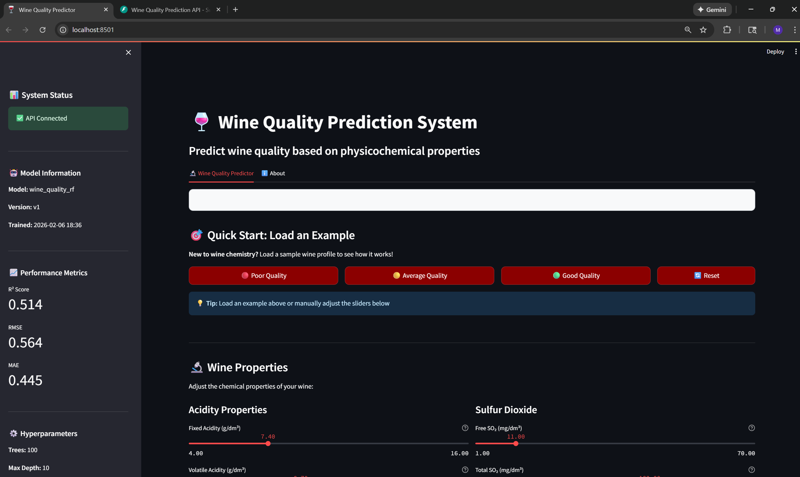
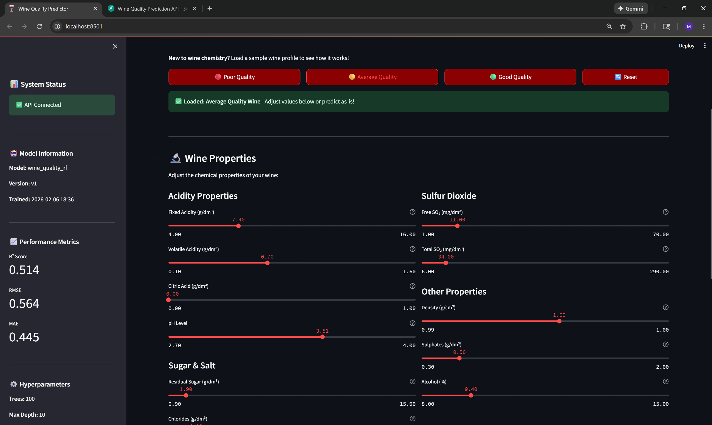
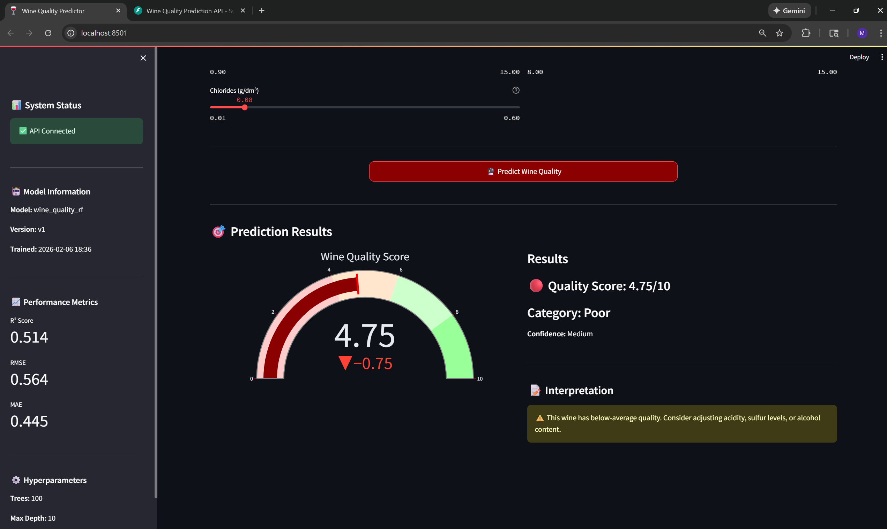
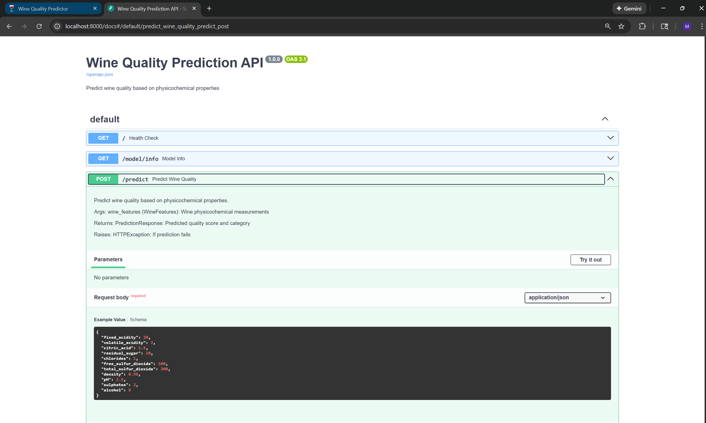

# 🍷 Wine Quality Prediction System

A full-stack machine learning application that predicts wine quality based on physicochemical properties using FastAPI, Streamlit, and scikit-learn.


---

## ✨ Features

- 🎯 **ML Predictions**: Random Forest model with R² = 0.51
- 🚀 **REST API**: FastAPI backend with automatic documentation
- 🎨 **Interactive UI**: Streamlit frontend with real-time predictions
- 📊 **Visual Analytics**: Gauge charts and quality categorization
- 🔄 **Example Profiles**: Pre-loaded wine samples for quick testing
- ✅ **Input Validation**: Pydantic models for data integrity

---

## 🎬 Demo

### Streamlit Frontend

*Main prediction interface with sliders and gauge visualization*


*Quick start with example wine profiles*


*Prediction results with quality categorization*

### FastAPI API Documentation

*Interactive Swagger UI for API testing*

---

## 🏗️ Architecture
```
┌─────────────────────────────────┐
│   Streamlit Frontend (8501)     │
│   Interactive User Interface    │
└─────────────────────────────────┘
              ↓ HTTP
┌─────────────────────────────────┐
│   FastAPI Backend (8000)        │
│   REST API + ML Inference       │
└─────────────────────────────────┘
              ↓ Loads
┌─────────────────────────────────┐
│   ML Model Files                │
│   Random Forest + Scaler        │
└─────────────────────────────────┘
```

---

## 🛠️ Tech Stack

**Frontend**
- Streamlit - Interactive web UI
- Plotly - Data visualization

**Backend**
- FastAPI - REST API framework
- Pydantic - Data validation
- Uvicorn - ASGI server

**Machine Learning**
- scikit-learn - Random Forest Regressor
- Pandas & NumPy - Data processing
- Joblib - Model serialization

---

## 📦 Installation

### Prerequisites
- Python 3.9+
- pip

### Setup
```bash
# Clone repository
git clone https://github.com/yourusername/wine-quality-prediction.git
cd wine-quality-prediction

# Create virtual environment
python -m venv venv
source venv/bin/activate  # On Windows: venv\Scripts\activate

# Install dependencies
pip install -r requirements.txt

# Train the model
python src/train.py
```

### Running the Application

**Terminal 1 - FastAPI Backend:**
```bash
uvicorn src.main:app --reload --port 8000
```

**Terminal 2 - Streamlit Frontend:**
```bash
streamlit run src/streamlit_app.py
```

**Access:**
- Streamlit UI: `http://localhost:8501`
- API Docs: `http://localhost:8000/docs`

---

## 📁 Project Structure
```
wine-quality-prediction/
│
├── src/
│   ├── config.py              # Configuration settings
│   ├── data.py                # Data loading & preprocessing
│   ├── train.py               # Model training pipeline
│   ├── predict.py             # Prediction logic
│   ├── main.py                # FastAPI application
│   └── streamlit_app.py       # Streamlit frontend
│
├── models/                    # Trained models (generated)
│   ├── wine_quality_rf_v1.pkl
│   ├── scaler_v1.pkl
│   └── metadata_v1.json
│
├── screenshots/               # UI screenshots
│
├── .env                       # Environment variables
├── .gitignore
├── requirements.txt
├── README.md
└── LICENSE
```

---

## 📖 API Documentation

### Endpoints

**Health Check**
```http
GET /
```
Response:
```json
{
  "status": "healthy",
  "model_version": "v1",
  "timestamp": "2026-02-06T18:36:31"
}
```

**Model Information**
```http
GET /model/info
```
Response:
```json
{
  "model_name": "wine_quality_rf",
  "version": "v1",
  "metrics": {
    "rmse": 0.564,
    "r2": 0.514
  }
}
```

**Predict Wine Quality**
```http
POST /predict
```
Request:
```json
{
  "fixed_acidity": 7.4,
  "volatile_acidity": 0.7,
  "citric_acid": 0.0,
  "residual_sugar": 1.9,
  "chlorides": 0.076,
  "free_sulfur_dioxide": 11.0,
  "total_sulfur_dioxide": 34.0,
  "density": 0.9978,
  "pH": 3.51,
  "sulphates": 0.56,
  "alcohol": 9.4
}
```
Response:
```json
{
  "quality_score": 5.82,
  "quality_category": "Average",
  "confidence": "High",
  "timestamp": "2026-02-06T19:45:12"
}
```

---

## 📊 Model Performance

**Dataset**
- Source: UCI Red Wine Quality Dataset
- Samples: 1,599 wines
- Features: 11 physicochemical properties

**Metrics**
| Metric | Value | Meaning |
|--------|-------|---------|
| R² Score | 0.514 | Explains 51.4% of variance |
| RMSE | 0.564 | Predictions ±0.5 points |
| MAE | 0.445 | Average error 0.44 points |

**Model Configuration**
- Algorithm: Random Forest Regressor
- Trees: 100 estimators
- Max Depth: 10
- Preprocessing: StandardScaler

**Quality Scale**
- 🔴 Poor (0-4): Below average
- 🟡 Average (5-6): Everyday wine
- 🟢 Good (6-7): Special occasions
- 💚 Excellent (8-10): Premium quality

---

### Environment Variables

Create a `.env` file in the project root:
```bash
cp .env.example .env
```

Or manually create `.env` with:
```bash
# .env
MODEL_VERSION=v1
N_ESTIMATORS=100
MAX_DEPTH=10
RANDOM_STATE=42
```

---

## 📝 License

This project is licensed under the MIT License - see the [LICENSE](LICENSE) file for details.

---

## 👨‍💻 Author

**Mohammed Ahnaf Tajwar**
- Master's in AI @ Northeastern University
- [LinkedIn](https://www.linkedin.com/in/mohammed-ahnaf-tajwar/) • [GitHub](https://github.com/ahnaf015)

---

